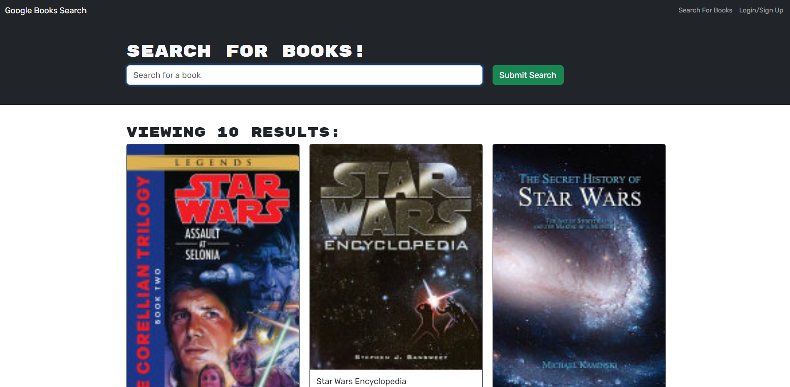
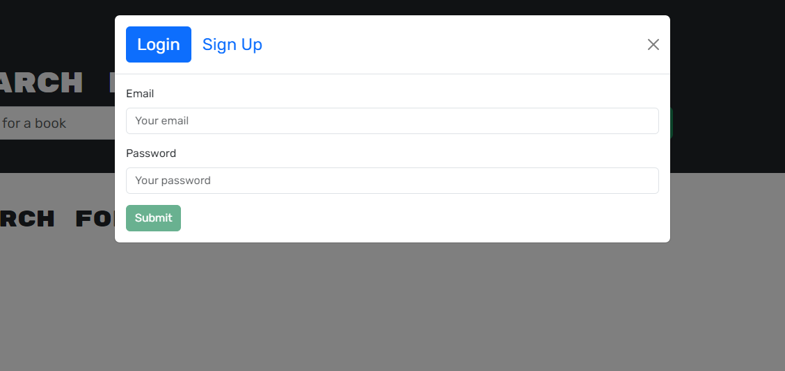
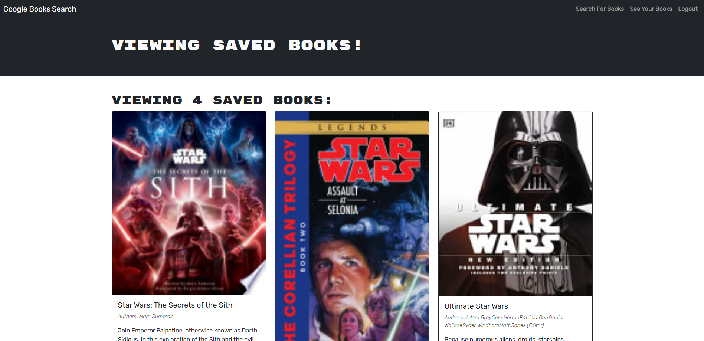

# Book-Search-Engine
This application is a Google Book search tool that was initially created using a RESTful API engine. It has undergone a transformation and now operates with a GraphQL API powered by Apollo Server. The application was constructed using the MERN stack, featuring a React front end, MongoDB database, and a Node.js/Express.js server and API.

## Features and Functionalities
Book Search Engine is a free web app that require no fees to sign up and use. the user will be able to use the web app to search book without the need to sign up but they will not have access to a main feature where they are able to save books.
Once the account is created or logged in to the web app the user will be able to search for any book and able to save the book to their favorite, and when the book is added to the favorite they will able to review what have been saved and able to remove any book that was saved to their favorite.
And the last function would be that the user will be able to login, sign up and log out.


## GitHub Repo URL
[GitHub Repo URL](https://github.com/AllenHirmiz/Book-Search-Engine)

## Website URL
[Heroku Application URL](https://book--search--engine-f616989fe361.herokuapp.com/)

## Website Contents
Single-page application where user is able to write code snippets 

## Installation
No Installation require as this is already deployed app on Heroku.


## Copying or Cloning

Clone my repository on GitHub.
  
  To install the application's `dependencies` and `devDependencies`, run:
  ```
  npm install
  ```
  
  To invoke the application, run:
  ```
  npm run develop
  ``` 


# Screenshots
## Home page
Home page is where you are able to search for books, access your saved books, Login or logout.



## Login/Sign up
When clicking the login/sign up button you will have the option to either login or to sign up for a new account.




## Saved Books
Saved book page will display all your book that you have saved and you'll have the option to remove a book if no longer needed.

